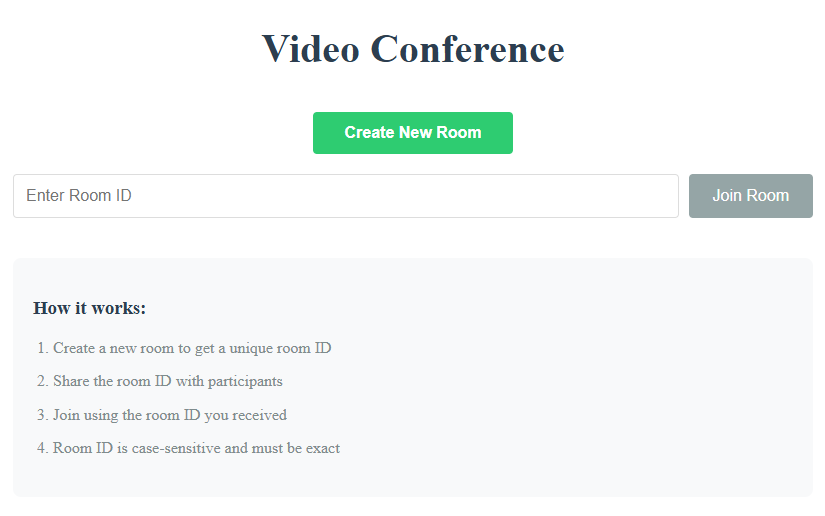

# Video Conference 🎥🔗

Реализация P2P видеоконференций с end-to-end шифрованием и чатом, использующая современный веб-стек.

 <!-- Добавьте реальный скриншот -->

## 🌟 Особенности

* 🛡️ **Безопасные комнаты** с уникальными UUID v4
* 📹 **P2P видеосвязь** через WebRTC (без промежуточных серверов)
* 💬 **Реалтайм-чат** с историей сообщений
* 🔊 **Управление устройствами** (камера/микрофон)
* 📱 **Адаптивный интерфейс** для всех устройств
* ⚡ **Мгновенное подключение** по ссылке-приглашению

## 🛠 ️ Технологии


## 🚀 Быстрый старт

### Предварительные требования

* Node.js ≥16.x
* npm ≥9.x
* Браузер с поддержкой WebRTC (Chrome, Firefox, Edge)

### Установка

1. Клонируйте репозиторий:

```bash
git clone https://github.com/your-username/video-conference.git
cd video-conference
```

2. Установите зависимости для клиента и сервера:

```bash
# Клиент
cd client && npm install

# Сервер
cd ../server && npm install
```

3. Настройте окружение:

```bash
# client/.env
REACT_APP_SERVER_URL=wss://your-server-url.onrender.com

# server/.env
PORT=3001
CORS_ORIGIN=https://your-client-url.vercel.app
```

### Запуск

#### Локальная разработка:

```bash
# Запуск сервера
cd server && npm run dev

# Запуск клиента
cd client && npm start
```

#### Продакшен-сборка:

```bash
# Сборка клиента
cd client && npm run build

# Запуск сервера
cd server && npm start
```

## 🌐 Deployment

### Клиент:

* Импортируйте репозиторий в [Vercel](https://vercel.com)
* Настройте переменные окружения (`REACT_APP_SERVER_URL`)
* Деплой из ветки `main`

### Сервер:

* Создайте Web Service в [Render](https://render.com)
* Укажите команду сборки: `npm run build`
* Команда запуска: `npm start`
* Добавьте переменные окружения из `server/.env`

## 🎯 Как использовать

### Создать комнату:

* Нажмите "Create New Room"
* Скопируйте ссылку из адресной строки

### Присоединиться:

* Введите ID комнаты на главной странице
* Или перейдите по прямой ссылке

### Управление:

* 🎚️ Кнопки управления медиа в нижней панели
* 💬 Откройте чат для обмена сообщениями
* ⚙️ Настройте устройства в выпадающем меню

## 📄 Лицензия

Этот проект распространяется под лицензией MIT. Подробности см. в LICENSE.

> **Примечание**: Для работы приложения требуется HTTPS-соединение и доступ к камере/микрофону в браузере.
